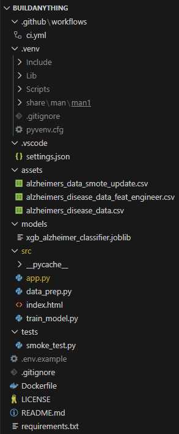
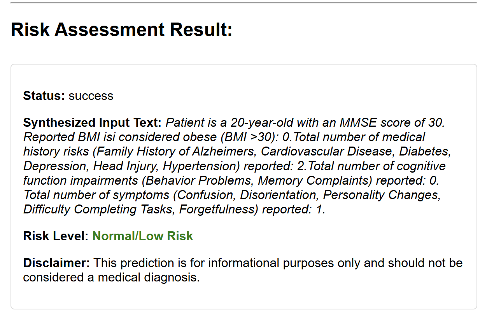
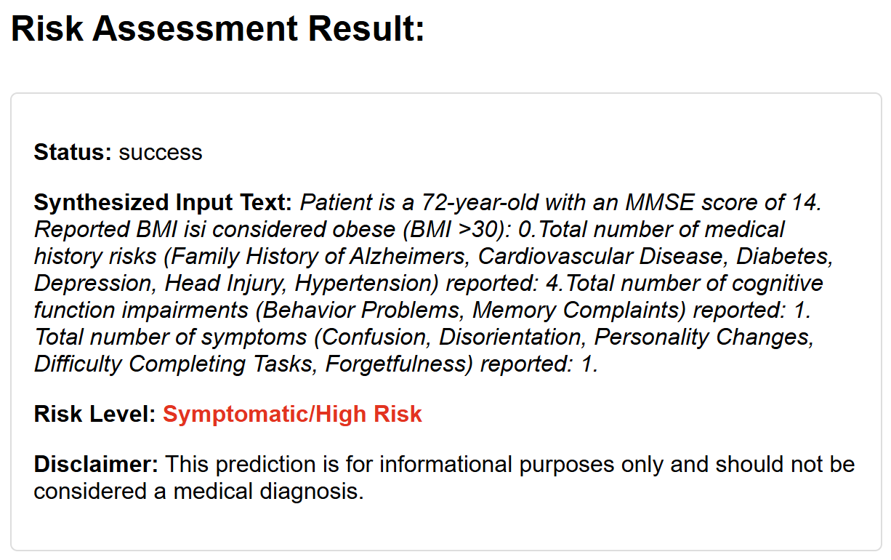

Case–Study Write–Up (Macy Moore, tyv8xe) 

Executive Summary  

Problem 

Imagine you are concerned that you could be at risk for developing Alzheimer’s Disease.  You may even be experiencing symptoms of it but are unsure about how seriously you should monitor these concerns.  The nearest Alzheimer’s specialist is hours away, and you cannot uproot your daily life to potentially have a low risk of development after all.  You can decide how urgent this visit to a professional may be by first completing the Alzheimer’s Risk Assessment.  The Alzheimer’s Risk Assessment addresses the lack of non-invasive and easily accessible tools to indicate an individual’s risk of developing Alzheimer’s Disease.  People can use this preliminary screening questionnaire to assess their symptoms and other risk factors.  

 

Solution 

Powered by a Python Flask API, this project is a web application that predicts a user’s likelihood of developing Alzheimer’s disease.  The assessment collects the user’s age, their score on the Mini-Mental State Examination, body mass index range, and amount of potential risk factors experienced from three consolidated categories.  The model predicts a patient's level of risk of a positive diagnosis through an XGBoost classifier that analyzes their submitted data and compares it to medical information from similar past patients. To maximize accessibility, the Alzheimer’s Risk Assessment is packaged in a Docker container, built through a Continuous Integration pipeline, and deployed to an Azure webapp. 

 

System Overview  

Course Concepts 

The Risk Assessment incorporates several concepts covered throughout the semester in DS 2022.  Most notably, it depends on an Application Programming Interface that uses Flask to make the machine learning model readily available for users through a web browser.  Logging and metrics are crucial in promoting model behavior and performance observability as it receives more data to analyze.  The project’s containerization through Docker allows for local development and packaging, reinforced by a CI build.  This Alzheimer’s Risk Assessment also references the topic of cloud deployment emphasized in the course with the containerized Flask API stored in an Azure web app within a resource group.   

 

Architecture Diagram 

 

 

Sources 

Data/Models/Services: 
| Asset            | Source                                 | Size     | Format                    | License                                   |
|------------------|-----------------------------------------|----------|---------------------------|-------------------------------------------|
| Initial Dataset  | Kaggle: alzheimers-disease-dataset      | ~2.5 MB  | CSV (Numeric Table)       | Refer to Kaggle Dataset Page              |
| Trained Model    | Custom Training (XGBoost)               | ~5 MB    | joblib (Python Artifact)  | MIT License                               |
| Deployment Image | GitHub Container Registry (GHCR)        | ~500 MB  | Docker Image              | MIT License                               |

External Sources Used
| Asset                        | Source                    | URL                                                                 
|------------------------------|---------------------------|---------------------------------------------------------------------|--
| XGBoost Classifier           | XGBoost Documentation     | https://xgboost.readthedocs.io/en/stable/                           |
| SMOTE Tool (Synthetic Data)  | imbalanced-learn library  | https://imbalanced-learn.org/stable/references/generated/imblearn.     over_sampling.SMOTE.html
| NIH BMI Guidelines           | National Institute of Health | https://www.nhlbi.nih.gov/calculate-your-bmi                       | 

Original LLM Model Reference
| Asset                  | Source                     | URL                                                               | Location |
|------------------------|----------------------------|-------------------------------------------------------------------|-----------------|
| bert-base-uncased     | Hugging Face Model Hub     | https://huggingface.co/google-bert/bert-base-uncased             |

Azure Deployment Reference
| Asset            | Source              |
|------------------|---------------------|
| Cloud Deployment | Azure Web App       |

Ops: Logs and Metrics
| Aspect               | Source              | How It's Used                                                                 |
|----------------------|---------------------|-------------------------------------------------------------------------------|
| Access Logs (Metrics)| Gunicorn            | Records each HTTP request; used to calculate latency, volume, and error rates. |
| Error Logs           | Gunicorn & Flask    | Captures startup/shutdown issues and application tracebacks.                 |
| Metrics Capture      | Application Code    | Measures prediction time and feature-processing; integrates w/ Prometheus/Grafana. |

How to Run (Local) 

# Run the two commands below to clear out previously generated data and models. If the user is running the container for the first time, omit the next two lines. 

Remove-Item -Recurse -Force ./processed_data 
Remove-Item -Recurse -Force ./models 

# Prepare data to be used in the model 

python src/data_prep.py 

# Train the model based on the alzheimers_disease_data_feat_engineer.csv file in the assets folder. The model will use this to make predictions about user input. 
python src/train_model.py 

# Like the Remove-Item commands, only run this docker build command specifying “--no-cache" the first time the container is built. 

docker build --no-cache -t alz-screener-chatbot:latest .  

# If the container is being restarted, use this build command instead of the above command. This is because the above command will re-run every single instruction in the Dockerfile, which is unneccessary. 
docker build -t alz-screener-chatbot:latest .  

# This command runs the Docker container. Once this command starts executing, create a second terminal to allow it to continue running in the background and run the health check without stopping the container. 
docker run --rm -p 8080:8080 --env-file .env.example alz-screener-chatbot:latest 

# The smoke test file smoke_test.py, located in the “tests” folder, has a built-in health check. This is how to run it through the terminal, and it should return that all 7 tests have passed. The first test specifically conducts a health check, while the other tests check for invalid input or have sample data to test for a predicted outcome. 

python tests/smoke_test.py 

Design Decisions  

Why this concept?  

I decided to use a Flask API with an XGBoost Classifier so that I could easily work around the structure of my dataset and achieve my goal of creating a machine learning model that predicts someone’s risk of developing Alzheimer’s Disease.  For this to be possible, i had to use a small and efficient service that would receive and process independent submissions of the screening survey to return a corresponding result.  An XGBoost Classifier met my needs the best because the original Kaggle dataset is comprised exclusively of numerical data, and XGBoost is most efficient for processing quantities with a high level of accuracy.  It also significantly reduces the amount of time taken to train the model before building the docker container, unlike a transformer such as bert-based-uncased meant to process text.  My next discovery, however, was that my model was not trained to recognize when a certain numerical value other than 0 or 1 in the dataset constituted a Low-Risk or High-Risk classification. 

Some categories in the dataset did not have a strong enough association with a positive or negative diagnosis. I had to use the concept of feature engineering to group risk factors together.  Instead of requiring the user to input an overwhelming amount of information, I was able to simplify the risk factors into more general categories such as symptoms and medical history.  This updated dataset, called “alzheimers_disease_data_feat_engineer.csv”, is present in my assets folder and is directly utilized by the model. 

I conducted additional research to ensure my understanding of the significance of each quality that would raise concerns for Alzheimer’s Disease.  This proved to be especially useful when including Body Mass Index in the model’s analysis.  By reading through the National Institute of Health Guidelines, I was able to determine that BMI alone is not a risk factor for Alzheimer's, but having a high enough BMI to qualify as obese is concerning when screening someone for the disease.  This helped me to simplify my response fields and model, where a ”yes” to having a BMI over 30 counted as the value 1 while "no" was 0.  Formatting this as a yes or no question helped my model to easily and accurately categorize whether a user’s BMI was high enough to qualify as a risk.  

One extremely important element of the design of my model is the disclaimer message I included at the top of the questionnaire.  It clarifies that the model does not provide a formal medical diagnosis.  Adding this to my model was extremely important because it reiterated the overall theme of the API that it is only for pre-screening.  I am not a medically trained professional and including this message helped me to practice the ethics of data science.  

 

Alternatives Considered and Why Not Chosen  

When I began working on this Alzheimer’s Risk Assessment, I first wanted to format it as a large language model that would ask a user question and analyze their answers, generating a personalized prediction of their diagnosis.  I soon discovered that this could be achieved much more efficiently with a Flask API that was better equipped to handle the quantitative dataset.  This realization occurred when I discovered that the transformer “bert-base-uncased" not only drastically slowed down my model training, but also had no way of correctly processing numerical data to develop correct predictions.  When I first researched how I could build my LLM, most examples used “bert-base-uncased" and transformers. I assumed it would work with my code.  However, after further investigation of my “train_model.py” and the hours it took to fully run, I looked for a solution that did not take as much time to work: XGBoost. 

After deciding to build a Flask API instead of an LLM, I discovered that some of my smoke tests were failing due to bias in my original dataset from Kaggle.  The data was skewed towards being healthy, rather than being diagnosed with Alzheimer’s Disease.  To combat this issue, I provided the biased dataset to Google Gemini to create a synthetic dataset.  While it did not contain real patient information, it followed the same format as the real dataset but contained an equal amount of entries for healthy patients and those with an Alzheimer’s diagnosis.  While this improved my model, my evaluation results from metrics reported its accuracy to only be around 71%.  This lower accuracy level prompted me to use feature engineering on the real dataset and ultimately abandon my smote data.  I left the “alzheimers_data_smote_update.csv” file in my assets folder to provide further context about how I attempted to implement it. 

 

Tradeoffs: Performance, Cost, Complexity, Maintainability 

When I edited my model to operate according to the real, feature engineered dataset, I had to accept that there would be slight bias.  However, this dataset was not only real, but helped train a more accurate model for predicting future outcomes.  Switching to a Flask API and an XGBoost Classifier instead of building an LLM with “bert-base-uncased" trains the model much faster now, and the model is better equipped to process the numerical data and predict a user’s future risk of Alzheimer’s disease.  This makes the execution of the project more straightforward and easier to maintain.   

 

Security/Privacy: Secrets Mgmt., Input Validation, PII handling 

I did not use any secrets in the creation of my model or its cloud deployment.  The repository and its webapp are visible to the public so that anyone can access them.  My smoke test file checks for invalid input.  This step is mixed in with other tests, including a health check and sample data entries.  When viewing the Risk Assessment through a web browser, the user receives an error if they attempt to fill a field with invalid input.  They receive a message that explains what the valid input should be, requiring them to redo their input.  The model clears their previous input when this message appears.  For example, if I listed my age as “twenty” years old, I would immediately receive a message that I must input a numerical value.  There is no personally identifiable information used by my model, and all entries in the dataset used to train the model are anonymous. 

 
Ops — Logs & Metrics
| Aspect                 | Source              | How It's Used |
|------------------------|---------------------|----------------|
| **Access Logs (Metrics)** | Gunicorn | Provides records of every HTTP request, including endpoint (/health), request method, status code, response size, and request duration. Forms the basis for calculating latency, traffic volume, and error rates. |
| **Error Logs**        | Gunicorn & Flask/App | Gunicorn captures startup/shutdown errors and application exceptions. Flask logs informational messages (e.g., “Model loaded successfully”) and error tracebacks. |
| **Metrics Capture**   | Application Code     | Provides granular metrics such as prediction time and feature-processing time; may integrate with libraries like Prometheus/Grafana. |

Scaling Considerations 

This model required both horizontal and vertical scaling, and they must be applied to both the web server and the prediction model.  Due to the nature of the application to load the model once to make predictions, rather than store data, new containers can be easily placed behind a load balancer.  Gunicorn is used to allow the container to manage multiple requests at the same time.  The model, xgb_alzheimer_classifier.joblib, is loaded into memory by the Gunicorn workers; therefore, scaling the application also does so for the prediction capacity.  If the classifier model is too large, resources must be allocated accordingly to ensure stability and prevent overload. 

 

Known Limitations 

This model’s frontend server strictly operates on plain HTTP on port 8080 through a web browser.  Therefore, the application cannot handle encrypted HTTPS traffic.  The model is also limited by the memory footprint.  This can be avoided by reducing the model size, increasing RAM allocation, and reducing the number of Gunicorn worker processes.  Doing this will result in the reduction of the number of copies of the model loaded into memory. 

 

Results & Evaluation  

Screenshots of Sample Outputs  

 

 

  

Brief Performance Notes 

The XGBoost classification model has achieved 78% accuracy on the test set according to the evaluation metrics during the execution of train_model.py. 

 

Validation/Tests Performed and Outcomes 

Smoke tests (seven total, can be found in tests/smoke_test.py) and CI building (image built and all dependencies installed) 

When the smoke test file is run, its output appears as:  

--- RUNNING DEBUG TESTS TO ISOLATE FEATURE BIAS --- 

--- RUNNING INITIAL SMOKE TESTS --- --- 1. Testing Health Check --- PASS: Health check succeeded. Status: ok 

--- 2. Testing Prediction: Original Low Risk Fail Case --- PASS: Prediction is correct. Result: Normal/Low Risk (0) 

--- 2. Testing Prediction: High Risk Profile --- PASS: Received expected 400 error. Message: JSON must contain a valid value for 'obesity'. 

--- RUNNING DEBUG TESTS TO ISOLATE FEATURE BIAS --- 

--- 2. Testing Prediction: DEBUG A: Healthy, Age 55 --- PASS: Prediction is correct. Result: Normal/Low Risk (0) 

--- 2. Testing Prediction: DEBUG B: Healthy, MMSE 28 --- PASS: Prediction is correct. Result: Normal/Low Risk (0) 

--- 2. Testing Prediction: DEBUG C: Healthy, ONE Symptom (Memory Complaints 1) --- PASS: Prediction is correct. Result: Normal/Low Risk (0) SMOKE TEST SUMMARY: 7/7 Tests Passed ============================== 

 

1) What’s Next  

Planned improvements, refactors, and stretch features.  

I would like to find out how to increase the accuracy of my model beyond 78%.  This project was one of my first experiences with feature engineering, and I believe that more practice with it will allow me to achieve more precise results in the future.  My current model also depends on its .env.example file, which can lead to errors if variables are missing or mistyped.  I can avoid this problem in the future by refactoring the app’s configuration loading to use a Python library that strictly validates environmental variables.  This ensures that everything is correctly typed and, if another error occurs, I can be certain that this was not the mistake.  Currently, my app screens users and does not save their results.  In the future, I could integrate a new database and corresponding feedback loop that saves the prediction results from each submission of the Risk Assessment.  This could also make it easier to track which predictions could be proven later to be incorrect, providing more insight into model accuracy. 

 

7) Links (Required) GitHub Repo: https://github.com/macyrm/BuildAnything.git 

 

Public Cloud App (optional):  alz-screener-webapp-gqagc6egf6dgd7cm.westus2-01.azurewebsites.net 
